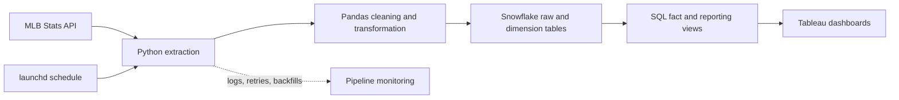
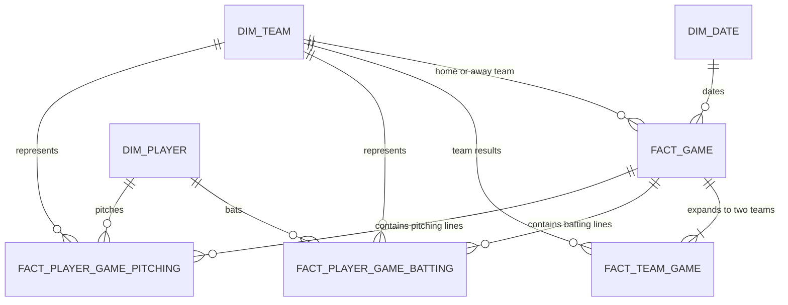

# MLB Analytics Pipeline and Tableau Dashboard

An end-to-end analytics project that turns daily MLB game data into analysis-ready Snowflake models and interactive Tableau reporting.

> **Project status:** The data pipeline and dashboard are complete. Dashboard screenshots and a Tableau Public link will be added after the public version is published.

## Project overview

MLB data is available through several API endpoints, but the responses are nested, updated as games progress, and stored at different levels of detail. Game results, team performance, batting lines, pitching lines, and player attributes cannot be combined safely without defining their grain and relationships.

I built this project to create a repeatable analytics system that:

- extracts schedules, boxscores, live game decisions, teams, and player profiles from the MLB Stats API;
- cleans and standardizes nested JSON data with Python and Pandas;
- loads raw and dimensional data into Snowflake through repeatable upserts;
- creates deduplicated analytical views at game, team-game, player-game, and daily league grains; and
- supports Tableau dashboards for daily scores, team results, and player performance.

The project demonstrates API ingestion, ETL design, dimensional modeling, SQL transformation, data-quality handling, pipeline automation, and dashboard development.

## Dashboard preview

<!-- Replace the placeholder below with the final dashboard image.
Recommended path: docs/images/mlb-dashboard-overview.png


-->

**Tableau Public:** Link coming soon

The dashboard is designed to answer questions such as:

- What were the results of each game on a selected date?
- Which hitters and pitchers produced the strongest daily performances?
- How did each team perform in terms of wins, runs scored, runs allowed, and run differential?
- How did league-wide scoring, home runs, hits, walks, and strikeouts change over time?

## Architecture



### Pipeline flow

1. **Extract:** Retrieve schedules, boxscores, live-feed decisions, teams, and player profiles from the MLB Stats API.
2. **Transform:** Flatten nested JSON into DataFrames, standardize numeric fields, convert baseball innings notation, assign opponents, and enrich player records with handedness.
3. **Load:** Stage each DataFrame in Snowflake and use `MERGE` statements to update existing records or insert new ones.
4. **Model:** Use SQL views to deduplicate updated API records and create analysis-ready facts at clearly defined grains.
5. **Visualize:** Connect Tableau to the appropriate fact or reporting view for each dashboard component.

## Data model



### Table grain

| Model | Grain | Primary analytical use |
|---|---|---|
| `DIM.DATE` | One calendar date | Date filtering and time-series analysis |
| `DIM.TEAMS` | One MLB team | Team name, league, division, venue, and active status |
| `DIM.PLAYERS` | One MLB player | Player identity, position, handedness, and current team |
| `ANALYTICS.FACT_GAME` | One game | Scores, status, venue, decisions, and game counts |
| `ANALYTICS.FACT_TEAM_GAME` | One team in one game | Wins, runs scored, runs allowed, and run differential |
| `ANALYTICS.FACT_PLAYER_GAME_BATTING` | One player's batting line in one game | Daily batting performance and hitter rankings |
| `ANALYTICS.FACT_PLAYER_GAME_PITCHING` | One player's pitching line in one game | Daily pitching performance and pitcher rankings |
| `ANALYTICS.FACT_DAILY_LEAGUE_SNAPSHOT` | One date | League-wide daily totals and averages |

Game, team-game, and player-game metrics have different grains. Tableau worksheets use the fact or reporting view that matches the measure being displayed so that game totals are not duplicated by player-level records.

## Dashboard data products

The analytics layer includes views designed for specific reporting needs:

- `GAME_SCOREBOARD` combines game results with home and away team labels.
- `DAILY_HITTER_LEADERS` combines batting lines with player and team attributes.
- `DAILY_PITCHER_LEADERS` combines pitching lines with player and team attributes.
- `FACT_TEAM_GAME` provides a consistent team-perspective record for every game.
- `FACT_DAILY_LEAGUE_SNAPSHOT` aggregates game, batting, and pitching activity to one row per day.

The hitter and pitcher performance scores are custom portfolio metrics used to rank daily performances. They are explanatory dashboard features rather than official MLB statistics.

## Key engineering decisions

### Preserve separate grains

The original API data describes games, teams, hitters, and pitchers at different levels of detail. I modeled those entities separately instead of flattening everything into one wide table. This prevents inflated scores, game counts, and team totals when Tableau aggregates player-level data.

### Handle corrected and repeated API records

MLB records may be refreshed after a game is updated or corrected. Raw records include a creation timestamp, and analytical facts use `ROW_NUMBER()` with `QUALIFY` to retain the latest record for each business key.

### Make reruns repeatable

The loader writes each DataFrame to a temporary Snowflake staging table and performs a `MERGE` into the target table. This supports rerunning dates without blindly appending duplicate records.

### Convert baseball innings correctly

Innings pitched use baseball notation: `.1` represents one out and `.2` represents two outs. The transformation layer converts those values to one-third and two-thirds of an inning before analysis.

### Enrich player data efficiently

Batting side and pitching hand require separate player-profile requests. The pipeline fetches those profiles concurrently and caches results within each run to reduce repeated API calls.

### Support recovery and backfills

HTTP requests use retry logic with exponential backoff for rate limits and temporary server failures. Command-line date ranges support historical backfills, and `--refresh-only` skips dates already present in the games table.

## Tools

- **Python and Pandas:** API extraction, JSON parsing, transformation, and orchestration
- **SQL and Snowflake:** staging, upserts, deduplication, dimensional models, and reporting views
- **Tableau:** interactive scoreboards, leaderboards, team analysis, and league trends
- **MLB Stats API:** schedules, boxscores, live feeds, teams, and player metadata
- **launchd:** configurable local scheduling on macOS
- **Git and GitHub:** version control and project documentation

## Repository structure

```text
mlb-tableau-dashboard/
├── README.md
├── requirements.txt
├── config.json
├── SCHEDULER_SETUP.md
├── com.mlb.tableau.dashboard.plist
├── sql/
│   ├── 01_setup.sql
│   ├── 02_dimensions.sql
│   ├── 03_facts.sql
│   └── 04_views.sql
└── src/
    ├── run_pipeline.py
    ├── extract.py
    ├── transform.py
    └── load.py
```

## Running the project

### 1. Clone the repository

```bash
git clone https://github.com/tcarlon94/mlb-tableau-dashboard.git
cd mlb-tableau-dashboard
```

### 2. Create an environment and install dependencies

```bash
python3 -m venv venv
source venv/bin/activate
pip install -r requirements.txt
```

### 3. Configure Snowflake

Create the database objects by running the scripts in `sql/` in numeric order. Then create a local `.env` file containing the Snowflake connection values expected by `src/load.py`. The `.env` file is excluded from version control.

### 4. Run the pipeline

Run the default date configured in `config.json`:

```bash
python3 src/run_pipeline.py
```

Backfill a date range:

```bash
python3 src/run_pipeline.py --start-date 2026-03-25 --end-date 2026-06-30
```

Process only dates that are not already present in `RAW.GAMES`:

```bash
python3 src/run_pipeline.py --start-date 2026-03-25 --end-date 2026-06-30 --refresh-only
```

For macOS scheduling instructions, see [`SCHEDULER_SETUP.md`](SCHEDULER_SETUP.md).

## Data quality and reliability

- Retries temporary API failures and rate-limit responses.
- Enforces HTTP timeouts and raises unsuccessful responses.
- Converts missing Pandas values to Snowflake `NULL` values.
- Deduplicates game and player-game records by their business keys.
- Uses temporary staging tables and Snowflake `MERGE` statements for repeatable loads.
- Logs pipeline progress and full exception details.
- Supports targeted date backfills and missing-date refreshes.

## Challenges and lessons learned

### Grain must be defined before visualization

Connecting game and player-level tables without accounting for their different grains caused game metrics to repeat across player records. I corrected this by separating game, team-game, batting, and pitching facts and selecting the appropriate source for each Tableau worksheet.

### Source APIs require defensive transformation

Not every game has a save pitcher, not every player has statistics in every boxscore, and numeric values may arrive as strings or missing values. The transformation layer validates nested fields and safely converts types before loading.

### Operational reliability is part of analytics engineering

Building the dashboard required more than writing a successful one-time script. Retries, logs, backfills, deduplication, caching, configurable dates, and idempotent loads make the pipeline easier to operate and troubleshoot.

## Planned improvements

- Publish the interactive dashboard to Tableau Public.
- Add dashboard screenshots and direct links to the relevant Tableau views.
- Add automated data-quality tests for uniqueness, completeness, and valid score ranges.
- Move scheduling from a local machine to a cloud-hosted workflow.
- Persist player-profile caching across pipeline runs.
- Add season-to-date trends and player/team streak analysis.

## License

MIT
